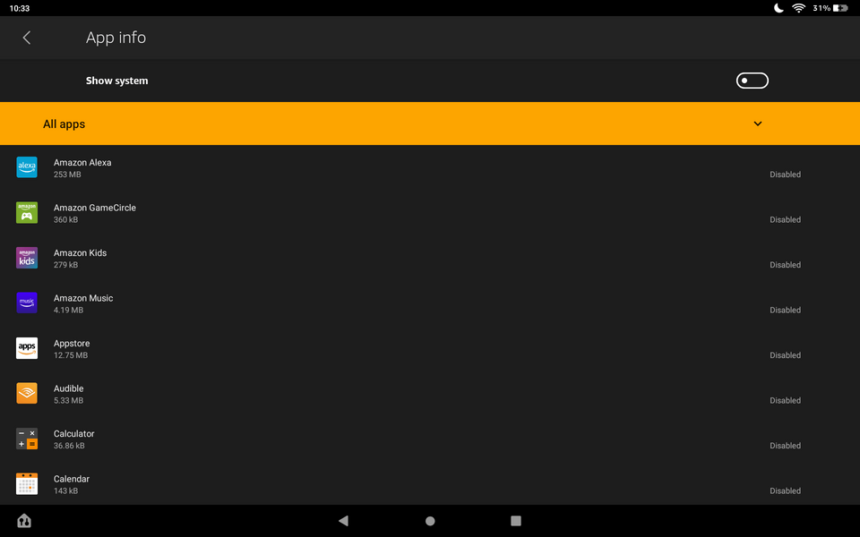

# Debloat
 
Debloat is a universal Android debloater tool to remove unwanted bloatware (pre-installed applications) from Android phones and tablets.


## Usage

### Requirements

1. Download and install JRE > 1.8.0
2. Enable Developer options
3. Enable USB debugging

## Development

- Build
```
javac ./*.java
```
- Run
```
jar cfm debloat.jar MANIFEST.MF ./
java -jar debloat.jar
```
- Generate javadoc
```
javadoc -d ./docs/site *.java
```

### Guide

<details>
  <summary>Amazon Fire</summary>

   

  App Name | Packages
  --- | ---
  Lockscreen ads | com.amazon.kindle.kso
  Forced OTA | com.amazon.kindle.otter.oobe.forced.ota<br>com.amazon.device.software.ota<br>com.amazon.device.software.ota.override
  Silk Browser | com.amazon.cloud9<br>com.amazon.cloud9.contentservice
  Shop Amazon | com.amazon.windowshop<br>com.amazon.csapp
  Appstore | com.amazon.venezia
  Prime Video | com.amazon.avod<br>com.amazon.providers.contentsupport<br>amaon.jackson19<br>com.amazon.tcomm.jackson
  Amazon Kids | com.amazon.tahoe<br>com.amazon.comms.kids<br>com.amazon.cloud9.kids<br>com.amazon.parentalcontrols<br>com.amazon.pm
  Kindle | com.amazon.kindle<br>com.amazon.ods.kindleconnect<br>com.amazon.webapp
  Amazon Alexa | com.amazon.dee.app<br>amazon.speech.sim<br>com.amazon.alexa.multimodal.gemini<br>com.amazon.alexa.youtube.app
  Audible | com.audible.application.kindle
  Amazon Music | com.amazon.mp3
  Amazon Games | com.amazon.ags.app
  Amazon Photos | com.amazon.photos
  Fire TV | com.amazon.whisperplay<br>com.amazon.whisperlink.core.android<br>com.amazon.whisperplay.contracts
  Goodreads | com.goodreads.kindle
  Calendar | com.android.calendar<br>com.android.rpvoiders.calendar
  Weather | com.amazon.weather
  Contacts | com.android.contacts
  Camera | com.android.camera2
  Calculator | com.android.calculator2
  Email | com.android.email
  Music | com.android.music
  Docs | com.amazon.zico
  Freevee | com.amazon.imdb.tv.mobile.app
  Maps | com.amazon.geo.mapsv3.resources<br>com.amazon.geo.mapsv3.services<br>com.amazon.geo.mapsv2
  Pico TTS | com.svox.pico
  Ivona TTS | com.ivona.orchestrator<br>com.ivona.tts.oem
  Amazon Retail Demo | com.amazon.kor.demo
  Amazon Backup and Restore | com.amazon.device.backup
  Fire Keyboard (Asian) | jp.co.omronsoft.iwnnime.mlaz
  Korean Language Pack | jp.co.omronsoft.iwnnime.languagepack.kokr_az
  Simplified Chinese Language Pack | jp.co.omronsoft.iwnnime.languagepack.zhcn_az
  Traditional Chinese Language Pack | jp.co.omronsoft.iwnnime.languagepack.zhtw_az
  System | amazon.speech.davs.davcservice<br>com.amazon.advertisingidsettings<br>com.amazon.android.marketplace<br>com.amazon.appverification<br>com.amazon.bioscope<br>com.amazon.client.metrics.api<br>com.amazon.cloud9.systembrowserprovider<br>com.amazon.device.metrics<br>com.amazon.device.sale.service<br>com.amazon.dp.fbcontacts<br>com.amazon.dp.logger<br>com.amazon.identity.auth.device.authorization<br>com.amazon.imp<br>com.amazon.kindle.rdmdeviceadmin<br>com.amazon.recess<br>com.amazon.shpm<br>com.amazon.tv.ottssocompoanionapp<br>com.android.backupconfirm
</details>

